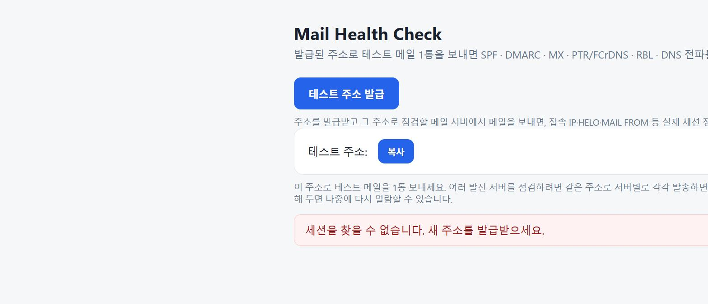

# ISSUE: 존재하지 않는 세션 URL 접근 시 빈 "테스트 주소" 박스가 남아 노출

- **Test Case ID**: TC-04-018
- **Date**: 2026-07-27
- **Severity**: Minor (기능 영향 없음 / 화면 오표시)
- **Status**: 수정 완료 후 재검증 Pass

## 재현 절차

1. 서버 실행 (`./gradlew :checker-web:bootRun`)
2. 브라우저에서 `http://localhost:8080/?s=00000000-0000-0000-0000-000000000000` 접속
   (존재하지 않는 세션 ID — 세션 파일 삭제·오타 URL 상황)

## 기대 결과

발급 화면(테스트 주소 발급 버튼)과 "세션을 찾을 수 없습니다" 오류 박스만 표시된다.

## 실제 결과

오류 박스와 발급 버튼은 정상 표시되나, **주소가 비어 있는 "테스트 주소: [복사]" 박스와
"이 주소로 테스트 메일을 1통 보내세요…" 안내 문구가 함께 남아 있다.**
사용자에게 존재하지 않는 빈 주소를 발급받은 것처럼 보이며, 복사 버튼도 클릭 가능한 상태다.



## 원인

`checker-web/src/main/resources/static/index.html` 의 `init()`:

```js
issueArea.hidden = true;
sessionArea.hidden = false;     // ← 세션 로드 시도 전에 먼저 세션 영역을 노출
...
if (res.status === 404) {
  statusEl.innerHTML = '<div class="err-box">세션을 찾을 수 없습니다…</div>';
  issueArea.hidden = false;     // ← 발급 영역만 되돌리고 sessionArea는 그대로 노출됨
  return;
}
```

404 분기(및 동일 구조의 `catch` 분기)가 `issueArea`만 복구하고 `sessionArea.hidden`을
되돌리지 않아, 주소가 채워지지 않은 세션 영역이 그대로 남았다.

## 수정 내용

`backToIssue(errHtml)` 헬퍼를 추가해 세션 복원 실패 시 세션 영역을 되돌리고 발급 화면으로
복귀하도록 통일했다 (404 분기 + catch 분기 공통 적용).

```js
function backToIssue(errHtml) {
  stopPolling();
  statusEl.innerHTML = '';
  sessionArea.hidden = true;
  issueArea.hidden = false;
  issueArea.insertAdjacentHTML('beforeend', errHtml);
}
```

## 재검증

- 동일 URL 재접속 → 발급 버튼 + 오류 박스만 표시, 빈 주소 박스 사라짐 (Pass)
- 정상 세션 URL 회귀 확인 → 카드 5건 정상 렌더, 발급 영역 숨김 유지 (Pass)
- `./gradlew build` 그린
